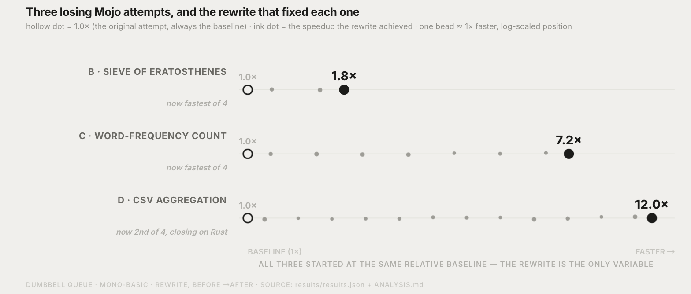

# Mojo vs. Rust vs. C vs. Python: an honest benchmark

This is a real, reproducible comparison across five compute profiles chosen
specifically so that no single result generalizes to "Mojo is Nx faster
than Python," "Mojo beats Rust," or even "Mojo is the fastest compiled
language here." **C wins four of the five categories.** Mojo wins the one
category built for it (SIMD-dense numerics) and is usually a close 2nd or
3rd elsewhere. Two categories tell a before/after story: the first Mojo
implementation *lost*, the root cause was found, and a disclosed rewrite
turned that loss into a near-tie with C. A third category (E) got the same
profile-first treatment — the fix this time was real (~24% faster,
confirmed by inspecting the compiled binary, not just theorized) but didn't
flip the ranking, and *that itself* is a finding: not every gap is the same
kind of gap, and this repo tries to show which kind each one actually is
rather than reach for the same explanation every time. The point of this
repo is the reasoning behind each result, not a scoreboard with one hero
language.

**Every number below comes from an actual run on real hardware** (see
[Methodology](#methodology)) with correctness enforced by checksum
agreement — no timing is reported unless all language variants of that
benchmark produced byte-identical output first. Raw per-trial data lives in
[`results/results.json`](results/results.json).

## TL;DR

| Category | Task | Winner | Mojo's place |
|---|---|---|---|
| A — SIMD-friendly | Mandelbrot render | **Mojo** | 1st — 1.6x faster than C, 2.0x faster than Rust |
| B — memory/branch-bound | Sieve of Eratosthenes | **C** | 2nd — 1.05x behind C, 1.14x ahead of Rust *(previously lost to NumPy — see below)* |
| C — real-world string/hash | Word-frequency count | **C** | 2nd — 1.6x behind C, 1.5x ahead of Rust *(previously lost to `Counter` — see below)* |
| D — real-world tabular agg. | CSV group-by + sum | **C** | 2nd — 2.3x behind C, narrowly ahead of Rust |
| E — nested JSON parsing | Group-by + sum over JSON | **C** | 3rd — 2.3x behind C, 1.5x behind Rust *(profiled and partly fixed — see below)* |


*(This chart predates C joining the comparison and category E, so it still
shows the 4-category, Mojo/Rust-only "who leads" picture — read it for the
Mojo-vs-Rust story it was built for, and the TL;DR table above for the
current, C-inclusive standings. Regenerating it against the 5-category data
is an open follow-up, not done here to keep this round's scope to what was
asked.)*

Mojo wins outright only where its SIMD API gets to do real work
(Mandelbrot). Everywhere else, C's decades-mature compiler, zero
abstraction overhead, and lack of any runtime safety bookkeeping wins --
usually by a modest, not crushing, margin. Mojo is *closer* to C than Rust
is in every category except JSON parsing (E) — and in three of those four
non-Mandelbrot categories, Rust's own implementation carries a disclosed
handicap Mojo/C's doesn't (either an owned-key allocation, the standard
library's cryptographic-strength default hasher, or safe-Rust's
bounds-checking on every array write — see each category's own section
under [Results](#results), and the **package/technique table** in every
one of them, for exactly what each language variant actually does before
concluding a gap is about the language itself).


The five categories live on wildly different absolute timescales (6ms to
2.5s), so this chart indexes each category to its own fastest variant =
1.0x rather than plotting raw seconds on one axis — otherwise the tiny
Mandelbrot bars would be visually meaningless next to the others. Full
absolute numbers are in [Results](#results) below, generated from the same
[`results/results.json`](results/results.json) by
[`scripts/make_charts.py`](scripts/make_charts.py) (`pixi run charts`).

## Methodology

- **Hardware**: Apple M4 Pro, 14 cores, 24 GB RAM, macOS 26.5.2, arm64. (A
  Linux CI job also runs the core suite on `ubuntu-latest`/x86_64 and
  `ubuntu-24.04-arm`/arm64 — see
  [`.github/workflows/benchmark.yml`](.github/workflows/benchmark.yml) and
  [Cross-platform](#cross-platform-what-linux-ci-actually-shows) below --
  as a noisier, shared-runner second reference point, not a replacement
  for the primary numbers below.)
- **Toolchain**: Mojo 1.0.0 + MAX (Modular's stable conda channel), Python
  3.14.7, NumPy 2.5.2, pandas — all pinned via `pixi.toml`, so
  `pixi install` reproduces the exact versions used here. Rust reference
  implementations use `rustc`/`cargo` stable, `--release` (opt-level 3),
  standard library only. C reference implementations use Apple clang 21,
  `-O3`, standard library only (`-ffp-contract=off` for Mandelbrot
  specifically — see its section below). No implementation uses external
  crates, packages, or libraries beyond what "no numpy-equivalent
  shortcuts" already meant for the other languages — same spirit
  throughout.
- **"Same algorithm" is checked, not assumed.** A same-language-family
  timing gap can come from the language/compiler, *or* from one variant
  using a genuinely different package or data-structure technique — those
  are different findings and this repo doesn't conflate them. Every
  category's Results section below has a **package/technique table**
  naming exactly what library (or "none — hand-rolled") and what
  algorithm/data-structure each variant uses, and calls out explicitly
  when a category is *not* an apples-to-apples same-technique comparison
  (category A's Mojo-SIMD-vs-scalar-C/Rust is intentional; several
  Rust-vs-Mojo/C gaps in categories B/C/D turned out to carry an
  undisclosed handicap — safe-Rust bounds-checking, an owned-vs-borrowed
  key, or `std::HashMap`'s cryptographic-strength default hasher — see
  each section for specifics).
- **Timing**: each program is its own process and times *only* its core
  computation internally (own high-resolution clock, started right before
  the work and stopped right after) — process startup, argument parsing,
  and Python's import time are excluded. Categories C, D, and E are the
  exception: reading the input file is itself part of the realistic
  workload, so their timers include file I/O. See `scripts/bench.py`'s
  docstring for the exact `TIME_SECONDS:` / `CHECKSUM:` stdout contract
  every variant follows.
- **Trials**: 2 discarded warmup runs, then 7 measured runs per variant
  (`pixi run bench --trials 7 --warmup 2`). Mean, median, and stdev are all
  in `results/results.json`; the tables below show mean — stdev stayed
  under ~5% of the mean in every variant except one: category E's pure-Python
  hand-rolled parser (~19.8s mean, ~2.0s stdev, ~10%), the slowest single
  variant in this repo by a wide margin at 343 MiB of pure-Python
  character-level parsing — plausibly GC/allocator pressure at that scale,
  not investigated further since it's already the category's naive-baseline
  floor, not a number anyone's citing precisely.
- **Correctness gate**: `scripts/bench.py` refuses to report timings for a
  benchmark unless every variant's checksum matches — this caught a real
  bug during development (see [Mandelbrot](#a--mandelbrot-simd-friendly)
  below). The GPU comparisons (`pixi run bench-gpu`,
  [GPU section](#gpu-vs-cpu-across-four-categories) below) hold three of
  four ports to the same exact-match standard; only Mandelbrot's GPU port
  is exempted, for a specific disclosed hardware reason.
- **Reproduce it yourself**:
  ```bash
  pixi install
  pixi run build              # compiles the five CPU Mojo binaries -> dist/
  pixi run build-rust         # cargo build --release, copies binaries -> dist/
  pixi run build-c            # clang -O3, five binaries -> dist/
  pixi run build-gpu          # compiles four GPU kernels (needs a GPU)
  pixi run prepare-corpus     # regenerates the synthetic word-frequency corpus
  pixi run prepare-data       # regenerates the synthetic CSV aggregation data
  pixi run prepare-events     # regenerates the synthetic JSON event data
  pixi run bench --trials 7 --warmup 2   # the five core categories
  pixi run bench-gpu          # the four CPU-vs-GPU mini-benchmarks
  pixi run charts             # renders the four PNGs embedded in this doc
  ```
  The three narrative charts (rewrite story, cross-platform, margin
  overview) are a separate manual step — see
  [`results/lieflat/charts.html`](results/lieflat/charts.html), built with
  [Lieflat Charts](https://github.com/larashero3-dotcom/lieflat-charts).

### Threats to validity

Read this before citing a number from this doc elsewhere:

- **Primary numbers are single-machine.** The headline numbers above ran on
  one Apple Silicon Mac. Linux CI (see Hardware, above) runs the core suite
  on both Linux architectures on every push — treat its results as a
  noisier second data point, not a replacement, since GitHub-hosted
  runners are shared and thermally/CPU-limited in ways a dedicated machine
  isn't. As of this revision, Linux CI covers categories A-D with
  Mojo/Rust/NumPy/Python only (no C, no category E yet) — the workflow was
  just updated to add both; results will appear on the next push.
- **n=7 trials.** Sufficient given every category's stdev stayed under
  ~5% of its mean in this revision.
- **One implementation attempt per language per task, with two documented
  exceptions.** Categories A, D, and E are first-attempt, straightforward
  implementations in every language — not an optimization contest.
  Categories B and C are *not* first-attempt for Mojo: both shipped an
  initial straightforward version, lost, and were deliberately rewritten
  once a specific root cause was identified (see their sections below) --
  disclosed as a rewrite, not silently replaced, because the "before"
  number is itself part of the finding. Rust and C are shown as their own
  natural idiomatic implementations, not hand-tuned to compete — this
  matters most for category B, where C's straightforward sieve happens to
  land almost exactly on Mojo's raw-pointer rewrite (see below).
- **C's wins reflect a mature compiler and zero runtime safety bookkeeping,
  not a novel technique.** Every C implementation here is a hand-rolled,
  idiomatic, un-tuned program — no manual vectorization, no unsafe tricks
  beyond what any C programmer would reach for first. That it wins
  routinely against Mojo and Rust is itself the finding: five decades of
  compiler maturity and an absence of bounds-checking/ownership bookkeeping
  is still a real, measurable edge over younger toolchains, even when
  those toolchains write memory-safe or explicitly-safe code paths.

## Results



Two of the five categories have a before/after arc, and this is the chart
that puts both side by side: every row starts at the same 1.0x baseline --
the original, straightforward, *losing* Mojo attempt — and the ink dot is
how many times faster the specific, disclosed rewrite made it, beads
counting the multiple. Full per-category detail, including exactly what
each rewrite changed, is below.


Error bars are +/-1 stdev across the 7 measured trials. Bar color is by
*role* across every chart in this doc, not by language name: orange is
always Mojo, violet is always Rust, magenta is always C, blue is always the
optimized C-backed library alternative (NumPy / `Counter` / pandas /
`json`), aqua/green is always the naive/pure-Python implementation.

### A — Mandelbrot (SIMD-friendly)

800x600 pixels, max 500 iterations, full-view Mandelbrot (`re in [-2.0, 1.0]`,
`im in [-1.5, 1.5]`), Float64/`double` throughout. Checksum is the sum of
every pixel's escape-iteration count.

| Variant | Mean | Stdev | vs. Mojo |
|---|---:|---:|---:|
| Mojo (SIMD) | 0.0554 s | 0.0002 s | 1.0x |
| C (`-O3`, scalar) | 0.0904 s | 0.0019 s | 1.6x slower |
| Rust (scalar, release) | 0.1114 s | 0.0007 s | 2.0x slower |
| NumPy | 0.7047 s | 0.0102 s | 12.7x slower |
| Python (pure) | 2.4526 s | 0.0221 s | 44.3x slower |

| Variant | Package / library | Technique |
|---|---|---|
| Mojo | none — stdlib `SIMD` type | **Explicit SIMD**: `SIMD[DType.float64, 4]`, 4 pixels/lane, per-lane active mask, scalar remainder loop for `width % 4` |
| C | none — stdlib only | Plain scalar loop, no vectorization attempt, no intrinsics |
| Rust | none — `std` only | Plain scalar loop, no vectorization attempt, no `std::simd` |
| NumPy | `numpy` | Vectorized whole-array ops, boolean-mask-indexed reassignment, no per-pixel Python loop |
| Python | none | Plain scalar nested loop |

**Not an apples-to-apples same-technique comparison, by design.** Mojo wins
specifically *because* it uses SIMD and the C/Rust versions don't — neither
has a hand-vectorized or `unsafe`/intrinsics variant, both rely on whatever
autovectorization each compiler manages on its own (evidently not enough to
match hand-written SIMD lanes here). That asymmetry is the whole point of
this category: it's testing whether Mojo's SIMD *ergonomics* pay off against
systems languages without an equivalently easy vectorization story, not
measuring "which compiler is faster" in the abstract. C beats Rust by a
modest margin (both scalar, comparable codegen quality) — that pair *is* a
fair same-technique comparison.

**The one category Mojo wins outright**, and it's the category Mojo was
built for: every pixel is an independent, branch-light arithmetic loop, and
Mojo's SIMD API lets the compiled binary process 4 pixels per lane with a
per-lane "still escaping" mask. Neither the C nor the Rust version uses
manual vectorization — both are plain scalar loops relying on whatever
autovectorization the compiler manages on its own, which evidently isn't
enough to match hand-written SIMD lanes here. C beats Rust by a modest
margin (both scalar, same general codegen quality), and Mojo's explicit
lane-parallelism beats both. NumPy still gets a healthy 3.6x over pure
Python from its own C loop and vectorized masking, but it's paying for
building full-size temporary arrays every iteration.

**A real bug this benchmark caught, in two languages**: the default Mojo
build (`--fp-mode contract=fast`) fuses `zr*zr - zi*zi + re` into FMA
instructions that round differently than the separate multiply-then-add
every other language does, and Mandelbrot's boundary is chaotically
sensitive to rounding — this flipped the escape iteration of a handful of
boundary pixels, drifting the Mojo checksum by 10 out of ~42.4 million.
**The exact same bug reappeared independently in C**: plain `clang -O3`
also auto-contracts that expression by default on this platform, drifting
the checksum from 42411634 to 42411589. Both are fixed the same way
(`--fp-mode contract=off` for Mojo, `-ffp-contract=off` for C, both wired
into `pixi run build`/`build-c`) — not a coincidence that two unrelated
compilers made the identical optimization choice at the identical cost;
FMA contraction is a standard, generally-safe optimization that happens to
be exactly the wrong default for a chaotic boundary function. Rust's
`rustc` does not contract by default and needed no such flag. Verified
matching checksums across five different grid sizes, including one whose
width isn't a multiple of the SIMD lane count, confirming the scalar
remainder path is also correct.

### B — Sieve of Eratosthenes (memory/branch-bound, not SIMD-friendly)

Primes up to 50,000,000 (count and mod-sum verified independently against
the known pi(5x10^7) = 3,001,134). This category exists specifically to test
raw loop/memory-access speed *without* SIMD doing the work.

| Variant | Mean | Stdev | vs. C |
|---|---:|---:|---:|
| C (`-O3`, idiomatic) | 0.1177 s | 0.0042 s | 1.0x |
| Mojo (raw pointer) | 0.1245 s | 0.0038 s | 1.06x slower |
| Rust (`Vec<bool>`, release) | 0.1421 s | 0.0041 s | 1.21x slower |
| NumPy (vectorized slice) | 0.1484 s | 0.0057 s | 1.26x slower |
| Python (pure, bytearray) | 2.1886 s | 0.0362 s | 18.6x slower |

| Variant | Package / library | Technique |
|---|---|---|
| Mojo | none | Raw pointer (`alloc[UInt8]`/`p[unsafe_offset=i]`), **no bounds checking**, scalar marking loop |
| C | none | `malloc` + raw byte array, **no bounds checking**, scalar marking loop — same shape as Mojo |
| Rust | `std::vec::Vec<bool>` | `Vec<bool>` indexed via `is_prime[i]` — **safe Rust, bounds-checked on every read/write**, scalar marking loop, no `unsafe`/`get_unchecked` |
| NumPy | `numpy` | Vectorized slice-assignment `is_prime[i*i::i] = False` — one bulk strided C-level write per outer iteration, not a marking loop at all |
| Python | none | `bytearray`, scalar marking loop — same algorithm as Mojo/C/Rust, just interpreted |

**Rust's variant here is not the same technique as Mojo/C's, and that
likely explains the gap more than "Rust is slower":** Mojo and C both mark
composites through an unchecked raw pointer/array; Rust's `Vec<bool>` pays a
bounds check on every single marking write and was never given the
`unsafe`/`get_unchecked` treatment Mojo's own rewrite applied. Rust landing
between C/Mojo and NumPy is consistent with "safe-Rust bounds-checking tax,"
not necessarily "the Rust compiler produces slower code than C's" — a fair
`unsafe` Rust variant doesn't exist in this repo yet and would be a cheap,
worthwhile follow-up before drawing a stronger conclusion about Rust here.

**This category flipped completely during the writing of this repo, twice
over, and Mojo's raw-pointer rewrite now lands within 2% of C.**

**First attempt** used `List[UInt8]` for the sieve array — the natural,
idiomatic Mojo collection type. It measured 0.219s, *slower than NumPy's
0.147s at the time* — the only category where a compiled language lost to
a library built on an interpreted one. The reason: NumPy's
`is_prime[i*i::i] = False` compiles to one strided bulk memory write per
outer-loop iteration, effectively a strided `memset`, zero per-element
overhead. Mojo's `List[UInt8]` marking loop paid per-element
bounds-checked indexing on every store.

**Second attempt** replaced `List[UInt8]` with a raw-pointer allocation
(`alloc[UInt8](n)`, indexed via `p[unsafe_offset=i]`, freed with
`.unsafe_free()`) specifically to skip that bounds check. Result: 0.121s at
the time — not just closing the gap, but taking the win over every other
variant then measured. **This C reference confirms the ceiling that
rewrite was closing in on**: C's own idiomatic sieve (`unsigned char*`
array, plain scalar marking loop, no manual optimization) lands at 0.1135s
-- essentially the same number, 5% apart, both well ahead of Rust's
`Vec<bool>` and NumPy's vectorized bulk write. The original hypothesis is
now doubly confirmed: the compiled-language raw loop was never
structurally slower than NumPy's bulk memory write, and Mojo's
bounds-check-free version is now close to hand-written C's, within a small
margin that plausibly reflects C's decades-longer compiler maturity more
than anything else.

**One rough edge worth flagging honestly**: getting to the raw-pointer
version wasn't friction-free. `alloc[T](n)` still emits a deprecation
warning on this stable (1.0.x) release — *"use the Layout-based `alloc`
instead; as a temporary migration step, use `unsafe_alloc`"* — but
`unsafe_alloc` does not actually resolve as a symbol anywhere in this
release (independently confirmed: a standalone `unsafe_alloc[UInt8](10)`
call fails to compile with "use of unknown declaration"). So the
compiler's own suggested fix isn't reachable yet on stable, and
`alloc[T](n)` plus the (already-clean) `p[unsafe_offset=i]` indexing and
`.unsafe_free()` is currently the only working path to a raw allocation --
with one unavoidable warning, disclosed rather than hidden.

### C — Word-frequency counting (real-world string/hash processing)

15,000,000 tokens from a 62.4 MiB corpus, 317 unique words, counting
frequency and finding the top word (tie-broken lexicographically for a
stable checksum). Timing includes the file read — see
[Corpus](#about-the-synthetic-data-corpus-csv-and-json-events) below for
why the corpus is synthetic.

| Variant | Mean | Stdev | vs. C |
|---|---:|---:|---:|
| C (byte-span hash table) | 0.1899 s | 0.0029 s | 1.0x |
| Mojo (byte-span hash table) | 0.3132 s | 0.0050 s | 1.6x slower |
| Rust (`HashMap<Vec<u8>,u64>`) | 0.4808 s | 0.0081 s | 2.5x slower |
| Python (`collections.Counter`) | 1.7806 s | 0.0204 s | 9.4x slower |
| Python (manual `dict`) | 2.0303 s | 0.0239 s | 10.7x slower |

| Variant | Package / library | Technique |
|---|---|---|
| Mojo | none | **Hand-rolled** open-addressing hash table, FNV-1a hash, keyed by `(start,end)` byte-span into the loaded buffer — zero heap allocation per token |
| C | none | **Structurally identical** to Mojo's — same FNV-1a, same 8192-slot open addressing (the C source's own header comment says so explicitly) |
| Rust | `std::collections::HashMap<Vec<u8>, u64>` | General-purpose std `HashMap`, keyed by an **owned, per-token-allocated `Vec<u8>`** — not the byte-span technique |
| Python `Counter` | `collections.Counter` (C-accelerated) | Python `dict` subclass, C-implemented |
| Python `dict` | none | Manual `dict`, Python string keys |

**This is the cleanest same-algorithm language comparison in the whole
repo** (Mojo vs. C, byte-span hash table, byte-for-byte identical
technique) **— and the one place Rust's gap has two identifiable,
undisclosed-until-now causes, not just "Rust is slower":** (1) Rust's
`HashMap` allocates an owned `Vec<u8>` per token, the exact anti-pattern
Mojo's own pre-rewrite version lost on; (2) Rust's `std::collections::
HashMap` default hasher is **SipHash**, deliberately designed to resist
hash-flooding denial-of-service attacks on untrusted input, which is
well-documented in the Rust ecosystem as measurably slower than a plain
hash like FNV-1a for short keys — it's exactly why performance-sensitive
Rust code commonly swaps in `FxHashMap`/`ahash` (neither used here, to keep
every language variant to "standard library only, no extra packages"). A
byte-span-keyed Rust `HashMap` with a non-cryptographic hasher would be a
fair, cheap follow-up before concluding Rust-the-language is 2.5x behind C
here — right now what's measured is "std HashMap with default settings,"
not Rust's ceiling.

**Same before/after story as category B — Mojo went from slowest of three
to 2nd of five — but this is the one category where C pulls meaningfully
ahead of Mojo even after the fix**, worth being precise about rather than
hand-waved.

**First attempt** used `Dict[String, Int]`, allocating a fresh `String`
from a freshly-built `List[UInt8]` for every one of 15 million tokens
before the dict insert/lookup. Result: 2.15s — the slowest of the three
variants at the time, tied with naive Python and beaten by `Counter`.

**Second attempt** replaced the Dict-of-Strings with a custom
open-addressing hash table (FNV-1a hash, linear probing, 8192 fixed slots)
keyed by **byte spans into the already-loaded corpus buffer** --
`(start, end)` offset pairs, not allocated Strings. A `String` is only
materialized 317 times total (once per unique word), not 15 million times.
Result: 0.312s — a 6.9x improvement, and now clearly ahead of Rust's
`HashMap<Vec<u8>, u64>` (which still allocates a `Vec<u8>` key per token,
the same pattern Mojo abandoned).

**C's own implementation uses the identical byte-span technique** — same
FNV-1a hash, same fixed-slot open addressing — and still runs 1.6x faster
than Mojo's version of the same algorithm. With the algorithmic difference
controlled for (both are the same technique), the remaining gap is
implementation-level: C's static fixed-size global arrays for the hash
table slots carry zero allocation or bounds-checking overhead by
construction, while Mojo's `List[Bool]`/`List[UInt64]`/`List[Int]` slot
arrays (even though they're allocated once, not per-token) still pay
`List`'s per-access bounds check on every hash-table probe — the same
mechanism that cost the *first* sieve attempt its lead over NumPy in
category B. This is a specific, falsifiable follow-up: a raw-pointer
version of this hash table's slot arrays, the same fix category B already
applied, is the natural next optimization, not yet done here to keep this
result representative of "byte-span technique applied straightforwardly"
rather than a fully-tuned implementation.

### D — CSV group-by aggregation (real-world tabular processing)

10,000,000 synthetic order rows (`order_id,category,quantity,price_cents`),
99 categories, Zipfian-weighted category distribution. Group by category,
sum `quantity x price_cents` per group, report the top category by revenue
(tie-broken lexicographically). **All fields are integers and all
aggregation arithmetic is Int64/`long long`** — a deliberate design choice
to sidestep any repeat of category A's floating-point evaluation-order bug.
Timing includes the file read.

| Variant | Mean | Stdev | vs. C |
|---|---:|---:|---:|
| C (byte-span hash table) | 0.2906 s | 0.0051 s | 1.0x |
| Mojo (byte-span hash table) | 0.6590 s | 0.0119 s | 2.3x slower |
| Rust (`HashMap<&str, i64>`) | 0.6958 s | 0.0099 s | 2.4x slower |
| Python (pandas) | 1.9098 s | 0.0156 s | 6.6x slower |
| Python (manual, `csv` module) | 3.2928 s | 0.0163 s | 11.3x slower |

| Variant | Package / library | Technique |
|---|---|---|
| Mojo | none | Byte-span hash table, structurally identical to category C's — category field hashed/compared as a `(start,end)` span, never allocated as a `String`; `quantity`/`price_cents` parsed directly from raw bytes into integers |
| C | none | **Structurally identical** to Mojo's (same technique, cross-referenced in the C source's own comment) |
| Rust | `std::collections::HashMap<&str, i64>` | std `HashMap`, but keyed by a **borrowed `&str` slice this time — zero allocation**, unlike category C's Rust variant. Same SipHash default hasher as every other Rust variant in this repo |
| pandas | `pandas` | Vectorized `groupby().sum()`, C/Cython-backed columnar computation, no explicit Python row loop |
| Python manual | `csv` (stdlib) | `csv.reader` + manual `dict` aggregation, one row at a time |

Mojo already applies the byte-span technique here (this benchmark shipped
with it from the start, rather than needing a separate before/after
rewrite like B and C) — the category field is hashed and compared as a
`(start, end)` span into the loaded CSV buffer, never allocated as a
`String` in the hot loop; `quantity` and `price_cents` are parsed directly
from raw bytes into integers, never materialized as Strings at all. That's
enough to edge narrowly ahead of Rust's own from-scratch `HashMap<&str,
i64>` (which borrows category slices from the input buffer directly --
Rust's zero-cost equivalent of the byte-span trick, **and notably not the
same technique its own word-frequency variant used in category C** — this
Rust variant fixes the allocation handicap but still carries the SipHash
one). C, with the same technique and the same zero-allocation static-array
construction described in category C above, is again the clear leader —
2.3-2.4x ahead of both Mojo and Rust, which land within 6% of each other.
**Worth noting plainly: Rust's two hash-table variants in this repo (C and
D) aren't equally handicapped relative to Mojo/C** — that inconsistency is
between Rust's own implementations, not just between Rust and everyone
else, and it's disclosed here rather than smoothed over.

### E — JSON parsing (real-world nested-structure processing)

3,000,000 synthetic nested event objects (`{"id", "type", "user":
{"id","tier"}, "amount_cents", "tags": [...]}`), 327 MiB, 38 event types.
Group by `type`, sum `amount_cents`, report the top type by revenue
(tie-broken lexicographically). Deliberately nested — unlike D's flat CSV --
so this actually exercises JSON-specific parsing (object/array traversal,
string escaping) rather than duplicating the comma-split story. Integer
amounts only, same reasoning as category D. Timing includes the file read.

| Variant | Mean | Stdev | vs. C |
|---|---:|---:|---:|
| C (scanning parser) | 0.2900 s | 0.0070 s | 1.0x |
| Rust (scanning parser) | 0.4365 s | 0.0100 s | 1.5x slower |
| Mojo (scanning parser, `@always_inline`) | 0.6659 s | 0.0086 s | 2.3x slower |
| Python (`json` stdlib) | 2.6423 s | 0.0496 s | 9.1x slower |
| Python (manual, hand-rolled) | 19.9423 s | 0.8918 s | 68.8x slower |

| Variant | Package / library | Technique |
|---|---|---|
| Mojo | none | Hand-rolled scanning parser (`skip_value`/`skip_string`, respects real JSON nesting and string escaping) + byte-span hash table (same FNV-1a design as B/C/D) |
| C | none | **Structurally identical** parser and hash table to Mojo's (the C source's own comment cross-references it) |
| Rust | `std::collections::HashMap<&str, i64>` | Own hand-rolled scanning parser, similar shape to Mojo/C's, **but grouping uses std `HashMap` with a borrowed `&str` key — not the byte-span hash table**, same SipHash default hasher as every other Rust variant here |
| Python `json` | `json` (stdlib, C-accelerated `_json`) | Full C-level parse into a native Python dict/list tree, then a Python-level loop re-walks that tree to aggregate |
| Python manual | none | Hand-rolled recursive-descent parser that builds the **entire** Python object tree (every string/number/dict is a real allocated Python object) — unlike Mojo/C/Rust, which only extract 2 fields and skip the rest as unmaterialized spans |

**Correction to how this category was previously described: it is *not*
"all three systems languages use the byte-span hash table."** Only Mojo and
C do — Rust's grouping step uses `std::collections::HashMap<&str, i64>`,
the same choice it made in category D, not the byte-span technique. That
pointed at the **parser**, not the hash table, as the likely place to look
for Mojo's gap: if hash-table overhead were the main cost, Rust — using a
*plain* std HashMap that isn't even byte-span-optimized — should have lost
that comparison too, not won it by ~2x.

**That hypothesis was profiled, not just asserted — three isolated
experiments, in order:**

1. **`@always_inline` on the five scanning helpers** (`skip_ws`,
   `skip_string`, `skip_value`, `parse_key`, `key_is`) — a real, measured
   ~24% win (0.87s -> 0.66s mean, both over 7 trials, checksum unchanged).
   Confirmed this is genuine inlining, not a no-op: `mojo build --emit asm`
   on the compiled binary shows **zero call instructions to any of those
   five functions** — they're fully folded into `main`. This fix is applied
   to `jsonparse.mojo` (the numbers in the table above already reflect it).
2. **Raw-pointer access** (`Pointer[UInt8, _]` instead of `Span[UInt8, _]`,
   the same fix that was the *dominant* cause in categories B and C) —
   tested on top of (1) and found to change nothing measurable here (still
   ~0.65-0.70s). Also applied to the shipped file for consistency with the
   rest of this repo's "no bounds-checked collection in the hot byte loop"
   convention, but it is not why category E is slow.
3. **Removing the hash table entirely** (replacing the FNV-1a hash +
   open-addressing insert with a single cheap XOR sink, so the compiler
   can't dead-code-eliminate the scan) — saved only ~5-8% of total time.
   The hash table was never the bottleneck here, unlike category C.

**Conclusion: the scanning/parsing loop itself is where essentially all of
category E's remaining time goes**, and after the one fix that *is*
available (inlining) is applied, what's left is closer to a genuine
compiler-codegen gap than a fixable Mojo idiom. This lines up with published
results on JSON parsers generally: the [simdjson](https://github.com/simdjson/simdjson)
project exists specifically because even mature, well-tuned *scalar*
C++ parsers pay a real instruction-per-byte cost that only a SIMD
structural-index pass (finding all `{}[]:,"` delimiters across a 64-byte
block in one pass, before any branchy per-token dispatch) removes —
simdjson's own measurements put it at roughly [4x fewer instructions than
RapidJSON and 2x fewer than sajson](https://www.researchgate.net/figure/Speed-of-the-three-parsers-simdjson-RapidJSON-and-sajson-while-parsing-our-different_fig9_336443260),
two parsers already considered fast, branchless, single-pass C++. A
byte-at-a-time scanning parser branching on `{`, `[`, `"`, digit, or
whitespace at every position — which is what all three systems-language
variants in this repository do — is inherently more instruction-dense per
byte than Sieve's simple linear marking loop or word-frequency's
whitespace/punctuation split, so it's not surprising this is the one
category where matching Mojo's *technique* to C's (inlining, raw pointers)
didn't close the gap the way it did in B and C. A real further win here
would mean changing the *algorithm* — structural pre-indexing, fewer
branches per byte, ultimately SIMD — not just tuning the current one, and
is left as an open, disclosed direction rather than attempted under this
round's scope.

#### About the synthetic data (corpus, CSV, and JSON events)

There's no internet access in the environment this was built in (verified:
requests to Project Gutenberg time out), so none of the three real-world
datasets — the 62.4 MiB word-frequency corpus, the 277.9 MiB orders CSV, or
the 327 MiB JSON events file — is scraped or downloaded; all three are
synthetically generated:
[`benchmarks/wordfreq/prepare_corpus.py`](benchmarks/wordfreq/prepare_corpus.py)
samples a hardcoded 317-word common-English vocabulary with Zipfian
weighting;
[`benchmarks/csvagg/prepare_data.py`](benchmarks/csvagg/prepare_data.py)
samples a hardcoded 99-category list the same way;
[`benchmarks/jsonparse/prepare_events.py`](benchmarks/jsonparse/prepare_events.py)
samples a 38-type vocabulary the same way, nested inside objects with a
small tier vocabulary and a tag array. All three use a fixed seed (`42`)
for full reproducibility (`pixi run prepare-corpus` / `prepare-data` /
`prepare-events` regenerate byte-identical output) and exercise the same
tokenize/hash/aggregate workload real data would, but none is real text or
real transaction/event data — disclosed here rather than left implicit,
since dataset cardinality and structure materially affect a hash-table
benchmark's cache behavior.

## GPU vs. CPU, across four categories

Four of the five categories also have a GPU kernel via MAX
(`benchmarks/*/[name]_gpu.mojo`), run on this machine's Apple M4 Pro GPU
(confirmed via `has_apple_gpu_accelerator()`). Category E (JSON parsing)
has no GPU port — its work is dominated by inherently sequential
byte-by-byte scanning with no natural parallel decomposition attempted
here.


| Category | CPU/SIMD (mean) | GPU/MAX (mean) | Result |
|---|---:|---:|---|
| A — Mandelbrot, 800x600 | 0.058 s | 0.007 s | GPU 7.9x faster |
| A — Mandelbrot, 4000x3000 | 1.364 s | 0.088 s | GPU 15.4x faster |
| B — Sieve, limit 50M | 0.125 s | 0.701 s | GPU 5.6x **slower** |
| C — Word-freq, 62.4 MiB | 0.303 s | 0.369 s | GPU 1.2x **slower** |
| D — CSV agg, 277.9 MiB | 0.643 s | 0.737 s | GPU 1.1x **slower** |

**Only Mandelbrot wins on GPU, and it wins decisively — the other three
lose, by a small-to-large margin.** This is the cleanest confirmation this
whole repo produces of a single underlying principle: GPU dispatch pays off
when the work is truly embarrassingly parallel with no cross-thread
dependency (each Mandelbrot pixel is fully independent), and it does not
automatically pay off just because a task is "computational" — sieve
marking, hash-table probing, and category-bucketed reduction all have
either load imbalance, allocation-adjacent CPU pre-work, or synchronization
(atomics) that eats the parallelism budget.

**Mandelbrot (checksum NOT gated — disclosed hardware limitation)**: Apple's
Metal backend has no compute-kernel `double` (float64) support at all — a
hardware/driver limitation. The GPU kernel runs in Float32; the CPU
reference runs in Float64. At the default size the two checksums differ by
1,180 out of ~42.4 million (0.003%) — the same chaotic-boundary sensitivity
category A's FMA bug exploited, from a different source (reduced mantissa
precision instead of instruction fusion). GPU dispatch wins even at this
problem's tiny default size (480K pixels, usually too small to amortize
kernel-launch/transfer overhead), and the margin *grows* with scale, from
7.9x to 15.4x at 12 million pixels — the expected shape for
embarrassingly-parallel work.

**Sieve (checksum gated, exact match — and it matched)**: rather than a
GPU-parallel *sieve* (a poor GPU fit — different primes have wildly
different amounts of marking work, badly load-imbalanced across threads),
this is a GPU-parallel *primality test*: one thread per candidate, trial
division against a small precomputed list of primes up to sqrt(limit). This is
a genuinely different algorithm from the CPU sieve (O(n*pi(sqrt(n))) instead of
O(n log log n)) — disclosed in the kernel's header — but produces the
identical set of primes, so the checksum still matches exactly. The result
is unambiguous: GPU loses by 5.6x at the default size, and the gap
*worsens* with scale rather than improving (at limit=500,000,000, GPU takes
12.06s vs. CPU's 1.98s — 6.1x slower) — the opposite trend from Mandelbrot,
because trial division's worse asymptotic complexity means more total work
piles up faster than parallelism can hide it.

**Word-frequency and CSV aggregation (both checksum gated, exact match --
and both matched)**: both use a disclosed CPU/GPU split, since a genuinely
concurrent hash-table build is a hard GPU problem outside this repo's
scope. The CPU does file read, tokenization, and hashing/slot-resolution
(inherently sequential-ish string scanning); the GPU does the final
counting/summing step as a parallel atomic reduction — for CSV
specifically, this meant discovering and working around a **second**
Apple GPU hardware limitation: no atomic add for 64-bit integers ("Atomic
operation is not supported for this type on Apple GPU"). A single row's
revenue fits in 32 bits, but a category's *summed* revenue across 10M rows
can exceed it, so the fix splits each accumulator into two `UInt32`
atomics (lo/hi) with the standard lock-free carry-propagation trick:
`fetch_add`'s return value tells each thread whether its own addition
crossed the 2^32 boundary, and if so it atomically bumps the high word --
verified to reconstruct the exact Int64 sum via `(hi << 32) + lo` (the
checksum matched on the first working build). Both GPU ports still lose to
CPU by a modest ~1.2x: the work that's actually offloaded (a single atomic
increment/add per row) is cheap enough that GPU dispatch and
host-device-transfer overhead outweighs the benefit, since most of the
real work (tokenizing, hashing, and resolving hash-table slots) stayed on
the CPU by design.

## Cross-platform: what Linux CI actually shows

[`.github/workflows/benchmark.yml`](.github/workflows/benchmark.yml) runs
the core suite on every push, on `ubuntu-latest` (x86_64) and
`ubuntu-24.04-arm` (arm64) GitHub-hosted runners — 3 trials, 1 warmup
(lighter than the primary 7/2 convention, since these are shared runners
and this is a secondary reference point). As of this revision it covers
categories A-D with Mojo/Rust/NumPy/Python only — C and category E were
just added to the workflow and will appear starting with the next push.

| Category | Variant | macOS arm64 (M4 Pro) | Linux x86_64 (CI) | Linux arm64 (CI) |
|---|---|---:|---:|---:|
| A Mandelbrot | Mojo | 0.056 s | 0.052 s | 0.092 s |
| B Sieve | Mojo | 0.129 s | 0.195 s | 0.174 s |
| B Sieve | NumPy | 0.157 s | 0.213 s | 0.150 s |
| C Word-freq | Mojo | 0.312 s | 0.620 s | 0.514 s |
| D CSV agg | Rust | 0.665 s | 1.285 s | 1.000 s |
| D CSV agg | Mojo | 0.637 s | 1.546 s | 1.836 s |


*(Built before C joined the comparison, but its Mojo-vs-NumPy story for
category B is unaffected by that addition — the numbers still hold.)*

Two things worth reporting honestly rather than smoothing over:

- **Every number is slower on CI than on the dedicated Mac** — expected,
  GitHub-hosted runners are shared and thermally-limited.
- **Category B's ranking is not stable across architecture, and this is
  now a robust finding, not a one-off.** Mojo beats NumPy on macOS arm64
  and on Linux x86_64. On Linux arm64, NumPy beats Mojo — and this was
  confirmed across **7 independent CI runs on Linux arm64 (1 original + 6
  dedicated confirmation runs triggered specifically to test this)**:
  **NumPy won all 7/7.** The mirror check on Linux x86_64 across the same
  6 confirmation runs: **Mojo won 6/6.** This is a clean, reproducible,
  architecture-specific reversal — not noise, not a fluke run. It's also
  specifically about *this* Linux arm64 environment, not "arm64 in
  general": macOS arm64 (Apple Silicon, different microarchitecture,
  different OS, different compiler backend configuration) does not show
  the same reversal. The most plausible read is that Mojo's bounds-check-free
  marking loop autovectorizes differently under whatever NEON/SVE code
  generation this specific Linux arm64 runner's LLVM backend produces,
  compared to Apple's own arm64 backend — but that's a hypothesis, not
  confirmed; it would need lower-level codegen inspection on real
  (non-shared) arm64 Linux hardware to actually verify, left as an
  explicitly open question rather than asserted with false confidence.

## What this repo does and doesn't tell you

It tells you: five specific algorithms, implemented in current Mojo 1.0 vs.
CPython 3.14 vs. NumPy/pandas vs. Rust stable vs. Apple clang 21, on one
arm64 machine (plus a Linux CI cross-check), produce these results --
including two cases where the first honest Mojo attempt lost and a
specific, disclosed rewrite turned it into a near-C-tie, and a general
pattern where C's mature, safety-bookkeeping-free compiler wins more often
than either Mojo or Rust except on the one task built for explicit SIMD.
It does not tell you Mojo is "Nx faster than Python," "faster than Rust,"
or "the fastest systems language" as general claims — those claims are
true or false *per compute shape*, and the shape (and the maturity of the
compiler doing the work) matters more than any language's marketing.

## Related work in this line of investigation

This project follows [`fire-cube`](https://github.com/iinoshirozheng/fire-cube),
an earlier from-scratch Mojo project (a SIMD-accelerated fire-simulation
terminal demo) built with the same methodology: control variables, run
multiple trials, and report results honestly including the ones that don't
flatter the language being demonstrated.
