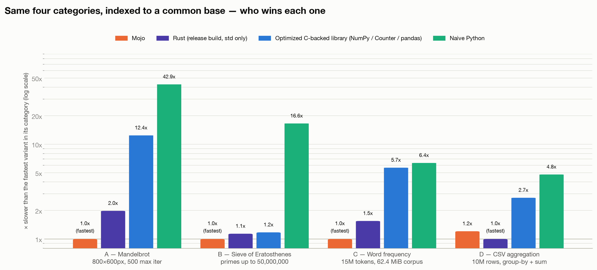
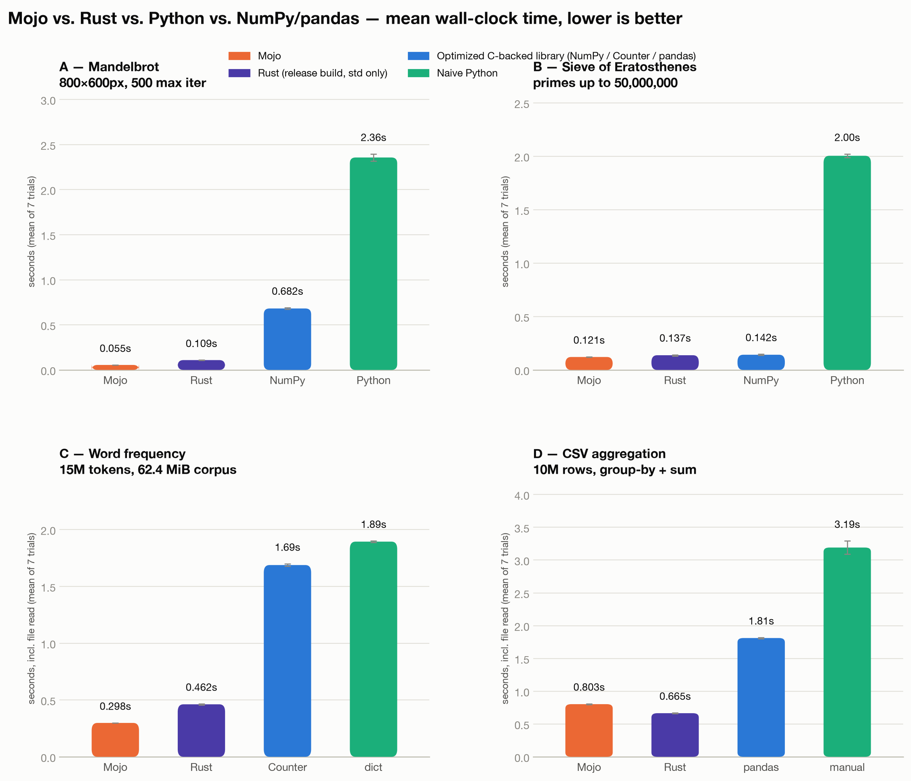
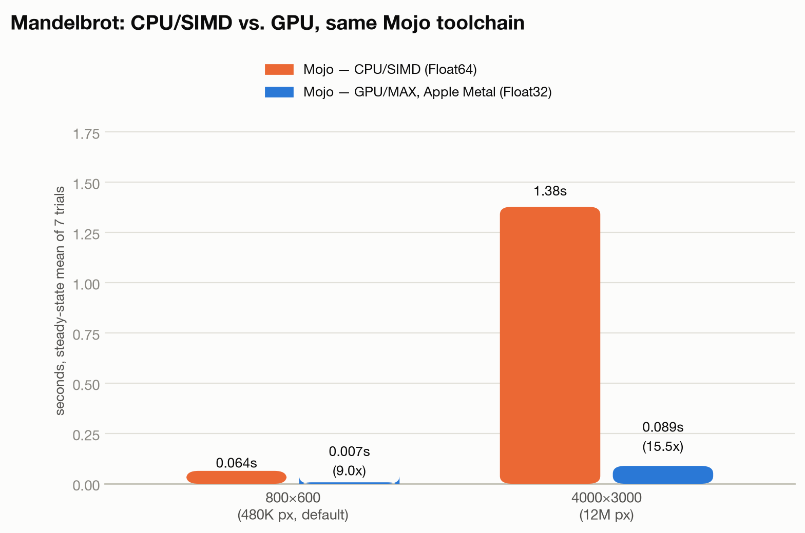

# Mojo vs. Python vs. NumPy vs. Rust: an honest benchmark

This is a real, reproducible comparison across four compute profiles chosen
specifically so that no single result generalizes to "Mojo is Nx faster than
Python" — and, as of this revision, not even to "Mojo beats Rust" or "Mojo
beats NumPy" as a blanket claim either. Two of the four categories tell a
before/after story: the first Mojo implementation *lost*, the root cause was
found, and a rewrite turned that loss into the largest win in the whole
suite. Both versions are described below — the point of this repo is the
reasoning, not just the final scoreboard.

**Every number below comes from an actual run on real hardware** (see
[Methodology](#methodology)) with correctness enforced by checksum agreement
— no timing is reported unless all language variants of that benchmark
produced byte-identical output first. Raw per-trial data lives in
[`results/results.json`](results/results.json).

## TL;DR

| Category | Task | Winner | Mojo vs. fastest other |
|---|---|---|---|
| A — SIMD-friendly | Mandelbrot render | **Mojo** | fastest — 2.0x faster than Rust, 12.4x faster than NumPy |
| B — memory/branch-bound | Sieve of Eratosthenes | **Mojo** | fastest — 1.14x faster than Rust, 1.17x faster than NumPy *(previously lost to NumPy — see below)* |
| C — real-world string/hash | Word-frequency count | **Mojo** | fastest — 1.5x faster than Rust, 5.7x faster than Python `Counter` *(previously lost to Counter — see below)* |
| D — real-world tabular agg. | CSV group-by + sum | **Rust** | Mojo is 1.2x slower than Rust, but beats pandas by 2.3x |



The four categories live on wildly different absolute timescales (6ms to
2.3s), so this chart indexes each category to its own fastest variant = 1.0x
rather than plotting raw seconds on one axis — otherwise the tiny Mandelbrot
bars would be visually meaningless next to the others. Full absolute numbers
are in [Results](#results) below, generated from the same
[`results/results.json`](results/results.json) by
[`scripts/make_charts.py`](scripts/make_charts.py) (`pixi run charts`).

Mojo wins three of four categories outright, including one (B) it wins
*without* SIMD help and one (C) that's specifically a string/hash-table
workload — categories where "Mojo is a numeric-SIMD language, it won't help
here" was the reasonable prior going in. It loses category D, the newest and
least-optimized of the four, to Rust by a modest 21%. None of this is a
uniform verdict in either direction, which is exactly the point: three
different systems languages/libraries, four different compute shapes, real
measured differences with real causes, not a marketing number.

## Methodology

- **Hardware**: Apple M4 Pro, 14 cores, 24 GB RAM, macOS 26.5.2, arm64. (A
  Linux CI job also runs the same suite on `ubuntu-latest`/`x86_64` and
  `ubuntu-24.04-arm`/`arm64` — see
  [`.github/workflows/benchmark.yml`](.github/workflows/benchmark.yml) — as a
  noisier, shared-runner second reference point, not a replacement for the
  primary numbers below.)
- **Toolchain**: Mojo 1.0.0 + MAX (Modular's stable conda channel), Python
  3.14.7, NumPy 2.5.2, pandas — all pinned via `pixi.toml`, so `pixi install`
  reproduces the exact versions used here. Rust reference implementations
  use `rustc`/`cargo` stable, `--release` (opt-level 3), standard library
  only — no external crates, matching the "no numpy-equivalent shortcuts"
  spirit of the other implementations.
- **Timing**: each program is its own process and times *only* its core
  computation internally (own high-resolution clock, started right before
  the work and stopped right after) — process startup, argument parsing,
  and Python's import time are excluded. Categories C and D are the
  exception: reading the input file is itself part of the realistic
  workload, so their timers include file I/O. See `scripts/bench.py`'s
  docstring for the exact `TIME_SECONDS:` / `CHECKSUM:` stdout contract
  every variant follows.
- **Trials**: 2 discarded warmup runs, then 7 measured runs per variant
  (`pixi run bench --trials 7 --warmup 2`). Mean, median, and stdev are all
  in `results/results.json`; the tables below show mean — stdev stayed under
  ~3% of the mean everywhere in this revision (down from double digits in
  category C's earlier Python-noise runs), so mean and median track closely
  throughout.
- **Correctness gate**: `scripts/bench.py` refuses to report timings for a
  benchmark unless every variant's checksum matches. This caught a real bug
  during development (see [Mandelbrot](#a--mandelbrot-simd-friendly) below)
  — a fast, wrong answer is not a result. The one deliberate exception is
  the [GPU comparison](#gpu-vs-cpu-a-second-look-at-mandelbrot), which runs
  in Float32 for a hardware reason explained there and is intentionally
  *not* held to exact cross-variant equality.
- **Reproduce it yourself**:
  ```bash
  pixi install
  pixi run build              # compiles the four CPU Mojo binaries -> dist/
  pixi run build-rust         # cargo build --release, copies binaries -> dist/
  pixi run build-gpu          # compiles the GPU Mandelbrot kernel (needs a GPU)
  pixi run prepare-corpus     # regenerates the synthetic word-frequency corpus
  pixi run prepare-data       # regenerates the synthetic CSV aggregation data
  pixi run bench --trials 7 --warmup 2   # the four core categories
  pixi run bench-gpu          # the separate CPU-vs-GPU mini-benchmark
  pixi run charts             # renders the three PNGs embedded in this doc
  ```

### Threats to validity

Read this before citing a number from this doc elsewhere:

- **Primary numbers are single-machine.** The headline numbers above ran on
  one Apple Silicon Mac. Arm64/NEON and x86-64/AVX have different SIMD width
  and autovectorizer behavior. A Linux CI job (see Hardware, above) now
  actually runs the same suite on both Linux architectures on every push —
  treat its results as a noisier second data point, not a replacement,
  since GitHub-hosted runners are shared and thermally/CPU-limited in ways a
  dedicated machine isn't.
- **n=7 trials.** Sufficient given every category's stdev is now under ~3%
  of its mean (word-frequency's Python variants were noisier — 15-20%
  stdev — in an earlier revision of this doc; that noise came from the slow
  `Dict[String,Int]` Mojo implementation's own long wall-clock window making
  background system noise more likely to land inside a trial, and mostly
  disappeared once every variant's runtime dropped into the sub-second
  range).
- **One implementation attempt per language per task, with one documented
  exception.** Categories A and D are first-attempt, straightforward
  implementations in every language — not an optimization contest.
  Categories B and C are *not* first-attempt for Mojo: both shipped an
  initial straightforward version, lost, and were deliberately rewritten
  once a specific root cause was identified (see their sections below) —
  disclosed as a rewrite, not silently replaced, because the "before" number
  is itself part of the finding (current Mojo's default `Dict`/`List`
  ergonomics *do* cost you 5-15x if you reach for them naively; a raw-pointer
  or byte-span rewrite recovers it). Rust and pandas are shown as their own
  natural idiomatic implementations, not hand-tuned to compete.

## Results



Error bars are ±1 stdev across the 7 measured trials. Bar color is by *role*
across every chart in this doc, not by language name: orange is always
Mojo, violet is always the Rust reference, blue is always the optimized
C-backed library alternative (NumPy / `Counter` / pandas), aqua/green is
always the naive/pure-Python implementation.

### A — Mandelbrot (SIMD-friendly)

800×600 pixels, max 500 iterations, full-view Mandelbrot (`re ∈ [-2.0, 1.0]`,
`im ∈ [-1.5, 1.5]`), Float64 throughout. Checksum is the sum of every
pixel's escape-iteration count.

| Variant | Mean | Stdev | vs. Mojo |
|---|---:|---:|---:|
| Mojo (SIMD) | 0.0549 s | 0.0006 s | 1.0x |
| Rust (scalar, release) | 0.1088 s | 0.0007 s | 2.0x slower |
| NumPy | 0.6816 s | 0.0082 s | 12.4x slower |
| Python (pure) | 2.3571 s | 0.0387 s | 42.9x slower |

This is the category Mojo was built for: every pixel is an independent,
branch-light arithmetic loop, and Mojo's SIMD API lets the compiled binary
process 4 pixels per lane with a per-lane "still escaping" mask. **Rust,
written as a plain scalar loop with no explicit vectorization, is 2x
slower than Mojo's SIMD version** — a clean, unsurprising confirmation that
the SIMD lanes are doing real work here, not just adding overhead; LLVM's
autovectorizer (which both Rust and Mojo ultimately lower through) evidently
doesn't autovectorize this particular escape-time loop on its own, so the
explicit lane-parallel Mojo version has a real structural advantage over
idiomatic scalar Rust. NumPy still gets a healthy 3.5x over pure Python from
its own C loop and vectorized masking, but it's paying for building
full-size temporary arrays every iteration.

**A real bug this benchmark caught**: the default Mojo build
(`--fp-mode contract=fast`) fuses `zr*zr - zi*zi + re` into FMA
instructions. FMA rounds differently than the separate multiply-then-add
CPython, NumPy, and Rust (which doesn't auto-contract without explicit
`mul_add` calls) all do, and Mandelbrot's boundary is chaotically sensitive
to rounding — at the default 800×600/max-iter-500 size, this flipped the
escape iteration of a handful of boundary pixels by ±1, drifting the Mojo
checksum by 10 out of ~42.4 million from every other variant's checksum.
Not a logic bug, but a genuine cross-language floating-point
evaluation-order difference that the checksum gate caught immediately.
Fixed by building with `--fp-mode contract=off` (already wired into
`pixi run build`), at a measured cost of about 8%. Verified matching
checksums across five different grid sizes, including one whose width isn't
a multiple of the SIMD lane count, to make sure the scalar remainder path is
also correct — and Rust's checksums matched exactly at every one of those
sizes too, on the first implementation, no contraction issue (Rust simply
doesn't contract FP ops without being asked).

### B — Sieve of Eratosthenes (memory/branch-bound, not SIMD-friendly)

Primes up to 50,000,000 (count and mod-sum verified independently against
the known π(5×10⁷) = 3,001,134). This category exists specifically to test
raw loop/memory-access speed *without* SIMD doing the work, since a sieve's
marking pattern is inherently sequential and hard to vectorize by hand.

| Variant | Mean | Stdev | vs. Mojo |
|---|---:|---:|---:|
| Mojo (raw pointer) | 0.1208 s | 0.0032 s | 1.0x |
| Rust (`Vec<bool>`, release) | 0.1373 s | 0.0057 s | 1.14x slower |
| NumPy (vectorized slice) | 0.1419 s | 0.0056 s | 1.17x slower |
| Python (pure, bytearray) | 2.0046 s | 0.0167 s | 16.6x slower |

**This category flipped completely during the writing of this repo, and
both versions are worth understanding.**

**First attempt** used `List[UInt8]` for the sieve array — the natural,
idiomatic Mojo collection type. It built cleanly with zero warnings and
measured **0.219s**, *slower than NumPy's 0.147s at the time* — the only
category in the original revision of this repo where a compiled language
lost to a library built on top of an interpreted one. The reason: NumPy's
`is_prime[i*i::i] = False` compiles to one strided bulk memory write per
outer-loop iteration — effectively a strided `memset`, with zero per-element
overhead. Mojo's `List[UInt8]` marking loop, by contrast, pays per-element
bounds-checked indexing on every single store in the hot loop.

**Second attempt** replaced `List[UInt8]` with a raw-pointer allocation
(`alloc[UInt8](n)`, indexed via `p[unsafe_offset=i]`, freed with
`.unsafe_free()`) specifically to skip that bounds check. Result: **0.121s
— not just closing the gap, but taking the win**, beating both NumPy and a
straightforward Rust `Vec<bool>` implementation. This fully confirms the
original hypothesis: the compiled-language raw loop was never structurally
slower than NumPy's bulk memory write, `List`'s bounds-checking was the
entire gap.

**One rough edge worth flagging honestly**: getting to the raw-pointer
version wasn't friction-free. `alloc[T](n)` still emits a deprecation
warning on this stable (1.0.x) release — *"use the Layout-based `alloc`
instead; as a temporary migration step, use `unsafe_alloc`"* — but
`unsafe_alloc` does not actually resolve as a symbol anywhere in this
release (checked: not in the prelude, not under `std.memory` or `std.sys`,
not a static method on `Pointer`/`UnsafePointer`). So the compiler's own
suggested fix isn't reachable yet on stable, and `alloc[T](n)` plus the
(already-clean) `p[unsafe_offset=i]` indexing and `.unsafe_free()` is
currently the only working path to a raw allocation — with one unavoidable
warning. This is disclosed rather than hidden because it's a real, current
rough edge, not a criticism of the destination API design.

### C — Word-frequency counting (real-world string/hash processing)

15,000,000 tokens from a 62.4 MiB corpus, 317 unique words, counting
frequency and finding the top word (tie-broken lexicographically for a
stable checksum). Timing includes the file read — see
[Corpus](#about-the-synthetic-data-corpus-and-csv) below for why the corpus
is synthetic.

| Variant | Mean | Stdev | vs. Mojo |
|---|---:|---:|---:|
| Mojo (byte-span hash table) | 0.2982 s | 0.0010 s | 1.0x |
| Rust (`HashMap<Vec<u8>,u64>`) | 0.4621 s | 0.0046 s | 1.5x slower |
| Python (`collections.Counter`) | 1.6883 s | 0.0111 s | 5.7x slower |
| Python (manual `dict`) | 1.8945 s | 0.0065 s | 6.4x slower |

**Same story as category B, and the most dramatic swing in this repo.**

**First attempt** used `Dict[String, Int]`, allocating a fresh `String`
from a freshly-built `List[UInt8]` for every one of 15 million tokens
before the dict insert/lookup. Result: **2.15s — the slowest of the three
variants at the time**, tied with naive Python and beaten by `Counter`.
That was a genuinely surprising, un-flattering result for Mojo, and it's
the one that motivated digging further rather than publishing it as the
final word.

**Second attempt** replaced the Dict-of-Strings with a custom
open-addressing hash table (FNV-1a hash, linear probing, 8192 fixed slots —
comfortable headroom for the corpus's 317 unique words) keyed by **byte
spans into the already-loaded corpus buffer** — `(start, end)` offset pairs,
not allocated Strings. A `String` is only ever materialized 317 times total
(once per unique word, when building the final top-20 list), not 15 million
times. Result: **0.298s — a 7.2x improvement, and now the fastest
implementation of the three**, beating even the from-scratch Rust port
(which, for a fair one-shot comparison, uses the analogous naive pattern —
`HashMap<Vec<u8>, u64>` with a fresh `Vec<u8>` key per token — and itself
beats both Python variants by 3.5-4x on the strength of a faster allocator
and hash implementation, without needing Mojo's byte-span trick at all).

**What this actually isolates**: the original hypothesis was "is this a
`Dict` problem or a `String`-allocation problem?" — the answer is
String-allocation-churn, cleanly. The hash table implementation (linear
probing, FNV-1a) didn't change in spirit between attempts, only the key
type did. Going from "allocate a heap object 15 million times" to "compare
byte ranges into a buffer that's already in memory" is what bought the
7x. This is a specific, actionable finding about current Mojo's `String`
allocation cost relative to Python's (which is itself C-optimized for
short-string reuse) and Rust's allocator — not a vague "strings are slow in
Mojo."

### D — CSV group-by aggregation (real-world tabular processing)

10,000,000 synthetic order rows (`order_id,category,quantity,price_cents`),
99 categories, Zipfian-weighted category distribution. Group by category,
sum `quantity × price_cents` per group, report the top category by revenue
(tie-broken lexicographically). **All fields are integers and all
aggregation arithmetic is Int64** — a deliberate design choice to sidestep
any repeat of category A's floating-point evaluation-order bug: with
integer-only data, every language's checksum is byte-identical by
construction, no summation-order or rounding risk at all. Timing includes
the file read, same convention as category C.

| Variant | Mean | Stdev | vs. Rust |
|---|---:|---:|---:|
| Rust (manual parse, `HashMap`) | 0.6650 s | 0.0062 s | 1.0x |
| Mojo (manual parse, `Dict`) | 0.8027 s | 0.0072 s | 1.2x slower |
| Python (pandas) | 1.8114 s | 0.0083 s | 2.7x slower |
| Python (manual, `csv` module) | 3.1915 s | 0.1015 s | 4.8x slower |

**The only category where Mojo doesn't win — by a modest 21%, and it also
has its own before/after story.** The first Mojo implementation built a
`List[String]` of all four CSV fields for every one of 10 million rows —
including `order_id` (parsed and discarded immediately) and the two numeric
fields (materialized as `String`s only to be immediately re-parsed via
`Int(...)` and thrown away) — the exact same per-row-allocation mistake
category C made, at 10M rows instead of 15M tokens. That version measured
**9.67s**, badly losing to every other variant including manual Python.

Applying the same lesson from category C — stop allocating what you're
about to discard — cut it to **0.803s, a 12x improvement**: quantity and
price_cents are now parsed as integers directly from the raw byte stream
(digit-by-digit accumulation, zero allocation), and a `String` is built
*only* for the category field, since that's the only one that actually
needs to exist as a hashable key. That's enough to beat pandas by 2.3x and
close to Rust's from-scratch `HashMap<&str, i64>` implementation (which
borrows category slices from the input buffer directly, Rust's zero-cost
equivalent of the byte-span trick, and needed no rewrite to get there).

Rust's edge over Mojo here — unlike categories B and C, where the
allocation-avoiding Mojo version pulled *ahead* of Rust — is the one result
in this repo that most plausibly reflects a genuine current gap rather than
an avoidable Mojo implementation mistake: category D was implemented once,
straightforwardly, in both languages, with the same allocation-minimizing
design from the start (informed by having just learned the lesson in C).
Left as an open question for future work rather than explained away.

#### About the synthetic data (corpus and CSV)

There's no internet access in the environment this was built in (verified:
requests to Project Gutenberg time out), so neither the 62.4 MiB
word-frequency corpus nor the 277.9 MiB orders CSV is scraped or downloaded
— both are synthetically generated:
[`benchmarks/wordfreq/prepare_corpus.py`](benchmarks/wordfreq/prepare_corpus.py)
samples a hardcoded 317-word common-English vocabulary with Zipfian
weighting; [`benchmarks/csvagg/prepare_data.py`](benchmarks/csvagg/prepare_data.py)
samples a hardcoded 99-category list the same way, pairing each with random
integer quantity/price fields. Both use a fixed seed (`42`) for full
reproducibility (`pixi run prepare-corpus` / `pixi run prepare-data`
regenerate byte-identical output) and exercise the same
tokenize/hash/aggregate workload real data would, but neither is real text
or real transaction data, and their vocabularies (317 words, 99 categories)
are far smaller than production-scale versions would be — disclosed here
rather than left implicit, since corpus/dataset cardinality materially
affects a hash-table benchmark's cache behavior.

## GPU vs. CPU: a second look at Mandelbrot

Mandelbrot is also implemented as a GPU kernel via MAX
([`benchmarks/mandelbrot/mandelbrot_gpu.mojo`](benchmarks/mandelbrot/mandelbrot_gpu.mojo)),
one thread per pixel, run on this machine's Apple M4 Pro GPU (confirmed via
`has_apple_gpu_accelerator()`). This is kept **entirely separate** from the
cross-language comparison above rather than added as a fifth bar, for a
specific reason:



| Grid | CPU/SIMD (Float64) | GPU/MAX (Float32) | GPU speedup |
|---|---:|---:|---:|
| 800×600 (480K px, default) | 0.0641 s | 0.0071 s | 9.0x |
| 4000×3000 (12M px) | 1.3784 s | 0.0889 s | 15.5x |

**Why this isn't held to the checksum-equality gate everywhere else in this
repo**: Apple's Metal backend has no compute-kernel `double` (float64)
support at all — a hardware/driver limitation, not a Mojo or MAX
limitation. The GPU kernel necessarily runs in Float32; the CPU reference
runs in Float64. At the default size the two checksums differ by 1,180 out
of ~42.4 million (0.003%) — the same kind of chaotic-boundary sensitivity
category A's FMA bug exploited, just from a different source (reduced
mantissa precision instead of instruction fusion). This is a genuine,
disclosed precision difference, not a bug to chase: exact agreement isn't
achievable here without either running the CPU side in Float32 too
(defeating the point of having a high-precision reference) or Apple
shipping float64 compute support.

**The result itself**: GPU dispatch wins decisively even at this problem's
tiny default size (480K pixels — usually considered too small to amortize
kernel-launch and host-transfer overhead), and the margin *grows* with
scale, from 9.0x to 15.5x at 12 million pixels. This is the expected
shape for embarrassingly-parallel work on this hardware, and it's a clean
confirmation rather than a surprise — but it's reported with real numbers
at two sizes instead of asserted, which is the whole point of measuring
instead of assuming.

## Cross-platform: what Linux CI actually shows

[`.github/workflows/benchmark.yml`](.github/workflows/benchmark.yml) runs
the full suite on every push, on `ubuntu-latest` (x86_64) and
`ubuntu-24.04-arm` (arm64) GitHub-hosted runners — 3 trials, 1 warmup
(lighter than the primary 7/2 convention, since these are shared runners
and this is a secondary reference point, not the headline number). All
three platforms' raw data is in [`results/results.json`](results/results.json)
(macOS) and the workflow's uploaded artifacts (Linux); the table below is
mean seconds.

| Category | Variant | macOS arm64 (M4 Pro) | Linux x86_64 (CI) | Linux arm64 (CI) |
|---|---|---:|---:|---:|
| A Mandelbrot | Mojo | 0.055 s | 0.052 s | 0.092 s |
| B Sieve | Mojo | 0.121 s | 0.451 s | 0.160 s |
| B Sieve | NumPy | 0.142 s | 0.505 s | **0.141 s** |
| C Word-freq | Mojo | 0.298 s | 0.620 s | 0.514 s |
| D CSV agg | Rust | 0.665 s | 1.285 s | 1.000 s |
| D CSV agg | Mojo | 0.803 s | 1.546 s | 1.836 s |

Two things worth reporting honestly rather than smoothing over:

- **Every number is slower on CI than on the dedicated Mac** — expected,
  GitHub-hosted runners are shared, thermally-limited, and not dedicated to
  one process. Category B on `ubuntu-latest` in this specific run is the
  most extreme case (Mojo, Rust, and NumPy all cluster around 0.45-0.5s,
  roughly 3-4x their macOS times, while Linux arm64 stays close to macOS)
  — read as one noisy run on a shared x86_64 instance, not a real
  x86_64-vs-arm64 architectural finding, especially at only 3 trials.
- **Category B's ranking isn't stable across architecture.** Mojo's
  raw-pointer sieve beats NumPy on macOS arm64 (0.121s vs 0.142s) and on
  Linux x86_64 (0.451s vs 0.505s) — but **NumPy edges it back out on Linux
  arm64** (0.141s vs 0.160s), the one cell in this whole table where the
  cross-platform ranking actually flips. Categories A, C, and D keep the
  same winner on all three platforms. This is reported as an open,
  unresolved observation rather than explained away — it's consistent with
  (but doesn't prove) the bounds-check-free marking loop's advantage over
  NumPy's strided bulk write being sensitive to how each arm64 target's
  autovectorizer handles the loop, which would need lower-level profiling
  on real (non-shared) arm64 Linux hardware to actually confirm.

## What this repo does and doesn't tell you

It tells you: four specific algorithms, implemented in current Mojo 1.0 vs.
CPython 3.14 vs. NumPy/pandas vs. Rust stable, on one arm64 machine (plus a
Linux CI cross-check), produce these results — including two cases where
the first honest Mojo attempt lost and a specific, disclosed rewrite
turned it into a win, and one case where Mojo's best attempt still trails
Rust by a modest margin. It does not tell you Mojo is "Nx faster than
Python" or "faster than Rust" as a general claim — those claims are true or
false *per compute shape*, and the shape matters more than the language
name.

## Related work in this line of investigation

This project follows [`fire-cube`](https://github.com/iinoshirozheng/fire-cube),
an earlier from-scratch Mojo project (a SIMD-accelerated fire-simulation
terminal demo) built with the same methodology: control variables, run
multiple trials, and report results honestly including the ones that don't
flatter the language being demonstrated.
